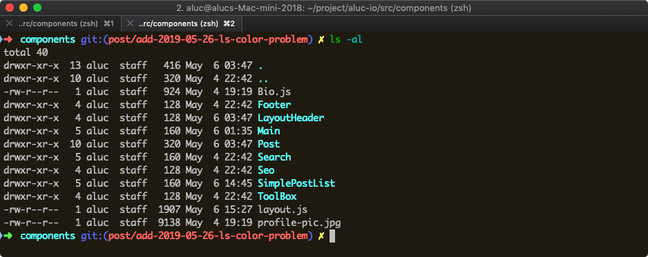
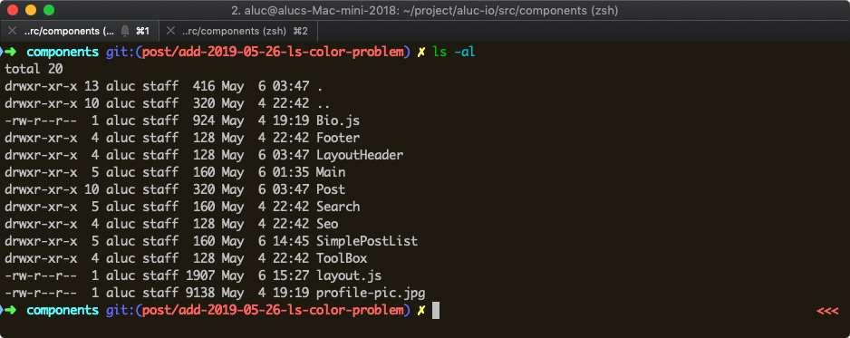
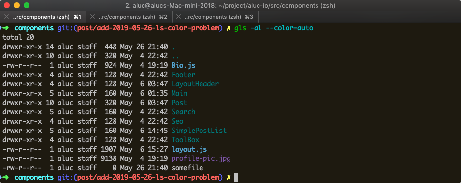
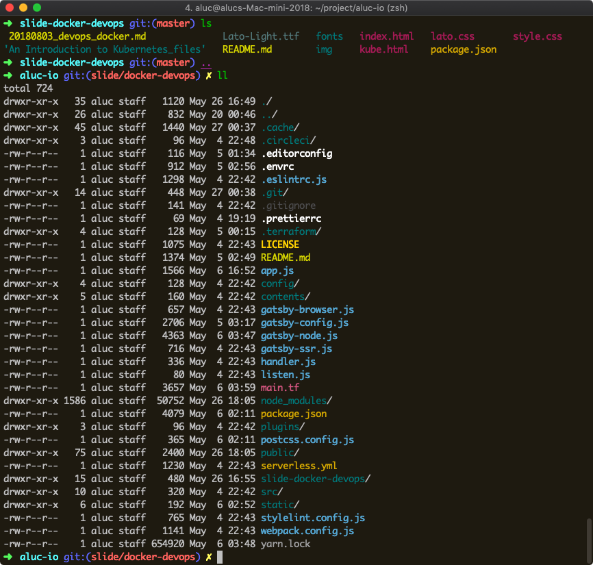
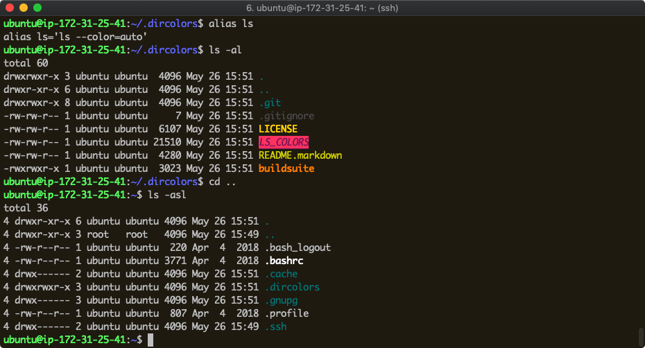

macOS terminal 에서 `ls` 에 `-G` 옵션을 주면 아래와 같이 디렉토리 색이
다른 컬러로 이쁘게 표시된다.



## 문제 발생 및 분석
그래서 `alias ls='ls -G'` 를 `.zshrc` 파일에서 설정한 뒤 사용 중
아래처럼 간헐적으로 색상이 안나오는 문제가 발생.



원인을 찾아보았다. 정상 케이스 에서는
```shell
$ which ls
ls: aliased to ls -G

$ unalias ls    
$ which ls
/bin/ls
```

`/bin/ls` 가 실행되지만
```shell
$ which ls
ls: aliased to ls -G

$ unalias ls    
$ which ls
/usr/local/bin/gls
```

컬러가 없어졌을 때 확인 하면 `coreutils` 를 추가 때 함께 설치된 것으로 추정되는
`/usr/local/bin/gls` 가 실행된다.

## Linux type, hash 명령어로 해결
Linux [type 명령어][type_guide]으로 커맨드의 종류나 해석 방법을 확인할 수 있다.
`-a` 옵션은 aliases, builtins, functions 을 포함한 실행 가능한 모든 위치를 보여준다.

그리고 [hash][linux_hash] 명령어는 한번 실행한 명령어의 위치를 **hash table** 에 저장해두고
이후에는 이 저장된 위치를 사용하여 빠르게 명령어를 실행시킨다. `rehash` 명령어를 통해
**hash table** 를 refresh 할 수 있다.

컬러가 안나오는 터미널에서 확인해보자.
```shell
$ type -a ls
ls is hashed to /usr/local/bin/gls
ls is /bin/ls
ls is /usr/local/opt/coreutils/libexec/gnubin/ls
ls is /bin/ls

$ hash | grep ^ls=
ls=/usr/local/bin/gls

$ rehash
$ hash | grep ^ls=
ls=/bin/ls
```

이렇게 하면 다시 `ls -G` 명령어로 디렉토리 색이 잘 나오는 것을 확인할 수 있다.
문제는 왜 `/usr/local/bin/gls` 가 `ls` 명령어로 hash 되었는지인데,
터미널을 열어 사용하다보면 간헐적으로 발생하는 현상으로 보아 어떤 스크립트를
실행하다 의도치 않게 `gls` 가 **hash table** 에 저장되는 현상같다.
어떤 문제인지 찾는 것 보다는 `alias` 설정에 `/bin/ls` 의 위치를 명시하여 해결.

```diff
-alias ls='ls -G'
-alias l='ls -G'
-alias ll='ls -alFG'
+alias ls='/bin/ls -G'
+alias l='/bin/ls -G'
+alias ll='/bin/ls -alFG'
```

디렉토리 색이 잘 표시되는 것으로 만족한다면 이후로는 더 진행하지 않아도 좋다.

## gls 와 dircolors 를 사용하여 더 개선하기
앞의 문제를 확인하다 `gls` 를 사용하여 더 다채로운 색을 표시 할 수 있다는 것을 알았다.
`gls` 가 없다면 [brew][brew] 로 설치하자.

```shell
$ brew install gls
```

간단하게 설명하면 `gls --color=auto` 명령어는 `LS_COLORS` 란 환경변수를 참고하여
각 파일 확장자, 속성 별로 색을 표시할 수 있는데, 이 환경변수 셋팅이 복잡함으로
[LS_COLORS][LS_COLORS] github 저장소에서 관리되는 `LS_COLORS` 파일을 이용하자.

```shell
$ git clone https://github.com/trapd00r/LS_COLORS $HOME/.dircolors
$ eval $( dircolors -b $HOME/.dircolors/LS_COLORS )
$ env | grep LS_COLORS
LS_COLORS=bd=38;5;68:ca=38;5;17:cd=38;5;113;1:di=38;5;30:do=38;5;127:ex=38;5;208;1:pi=38;5;126
...(생략)

$ gls -al --color=auto
```





디렉토리 와 파일 확장자, 속성별로 색이 잘 구분되는 것을 볼 수 있다.

## shell 시작 설정 업데이트
`~/.bashrc` 또는 `~/.zshrc` 파일에 위 `LS_COLORS` 환경변수 셋팅부분을 추가시켜
쉘 실행시 자동으로 셋팅되게하자. 또한 `alias` 설정도 업데이트하여 `gls` 로 연결시키자.

```diff
+eval $( dircolors -b $HOME/.dircolors/LS_COLORS )

-alias ls='/bin/ls -G'
-alias l='/bin/ls -G'
-alias ll='/bin/ls -alFG'
+alias ls='/usr/local/bin/gls --color=auto'
+alias l='/usr/local/bin/gls --color=auto'
+alias ll='/usr/local/bin/gls -alF --color=auto'
```

`gls` 는 GNU util 이므로 ubuntu 의 기본 `ls` 명령어 이기도 하다.
우분투에서도 위 셋팅을 동일하게 사용할 수 있어서 개이득.



[type_guide]: https://bash.cyberciti.biz/guide/Type_command#type_-a_Command_Examples
[linux_hash]: https://en.wikipedia.org/wiki/Hash_(Unix)
[LS_COLORS]: https://github.com/trapd00r/LS_COLORS
[brew]: https://brew.sh/
